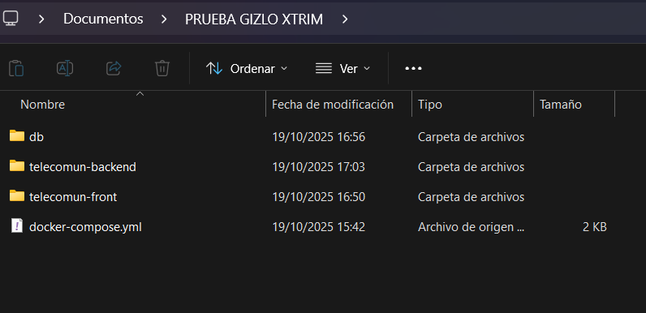

Xtrim Backend — Flask API

Backend desarrollado en Flask como parte del reto Fullstack.  
Expone una API REST para gestionar información de suscripciones, consumo y facturación simulada.  
Incluye pruebas unitarias e integración, además de soporte completo para ejecución en Docker Compose.

**Prerrequisitos**

- Python 3.11+
- Docker y Docker Compose instalados
- Base de datos MySQL dockerizada (requerida para que el endpoint `/health` funcione correctamente)

Si la base de datos no está corriendo, `/health` devolverá un error 500 indicando `"db": "unreachable"`.

**Crear entorno virtual e instalar dependencias**
> - python -m venv .venv
> - source .venv/Scripts/activate
> - pip install -r requirements.txt
> - python -m app.server

La API quedará disponible en:
> http://localhost:5000/health

Desde navegador o terminal:
> curl -s http://localhost:5000/health

Respuesta esperada (cuando la DB está conectada):
>{
  "status": "success",
  "code": 200,
  "data": { "db": "connected" },
  "message": "OK"
}

**Pruebas unitarias e integración**
Este proyecto incluye pruebas automáticas con pytest.
Para ejecutarlas:
> pytest

Ejemplo de salida esperada:
>4 passed in 0.14s

Las pruebas verifican:

>/health responde con la estructura esperada.

>/api/v1/subscriptions/list maneja correctamente los casos 400, 404 y 200.

**Docker / Docker Compose**

El proyecto está preparado para levantar tanto la base de datos como el backend usando un solo comando.

Construir y levantar todos los servicios
OBLIGATORIO TENER ESTA ESTRUCTURA EN LA CARPETA
telecomun-backend/
├── 
telecomun-front/
├── 
db
├── 
docker-compose.yml

Abrir una terminal en la ruta donde estas las carpetas y compose y ejecutar
>docker compose up -d --build

>Se expondra en el puerto 5000

>http://localhost:5000